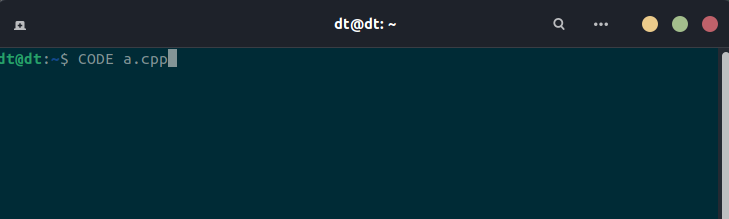
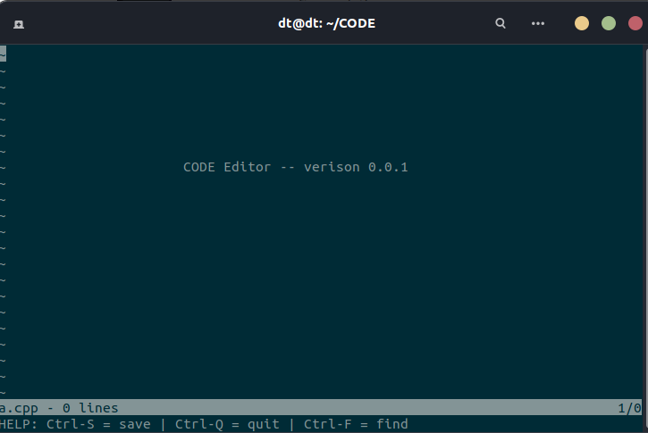
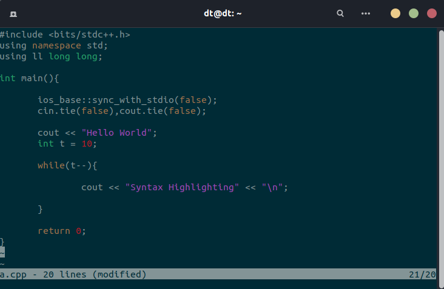
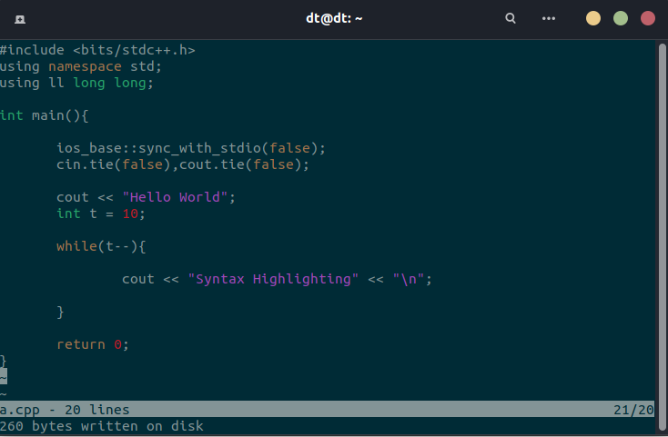
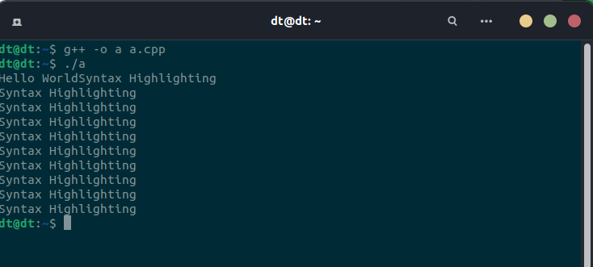
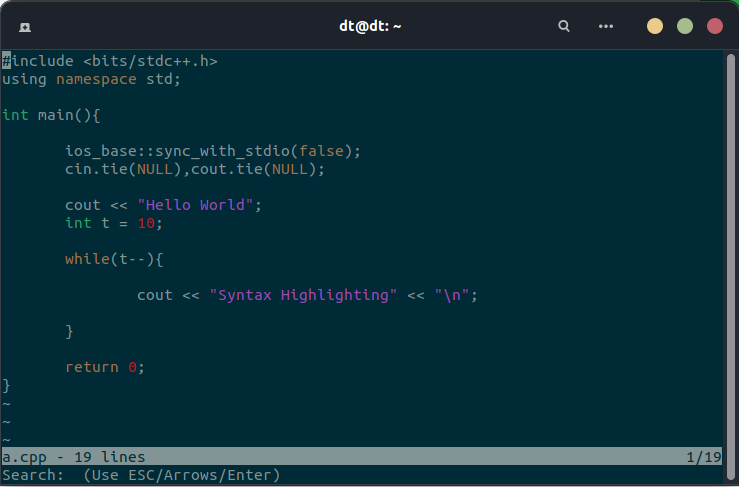
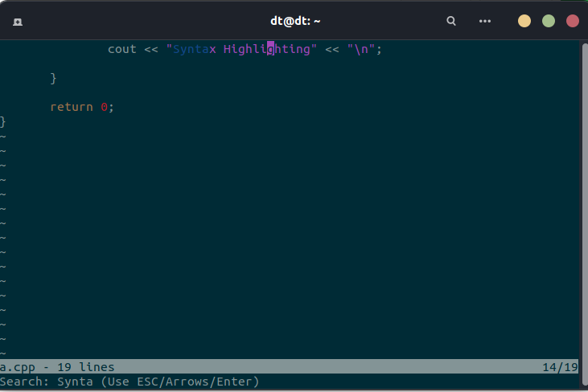

# CODE
A minimalistic bare bone emulation of VIM/NVIM Text Editors

This project has been made comprehensively to be understandable by layman
too. This had been on my list for many days and I had it on my private repo for 
too long.

**CODE** is a text editor that is extremely light and minimal when
compared to ***VIM/NVIM*** . Its compatible with all terminal and shell prompts 
including WSL in windows. It has nearly 1200 lines of Code ,and 
has been made in a very modular approach with no additional dependencies and entirely written in c.

Installation : 
    
    git clone https://github.com/Abhineel-Nandi/CODE.git
    cd CODE/
    make
    sudo cp CODE /usr/local/bin/

Usage: CODE `<filename>`

Keys:

    CTRL-S: Save
    CTRL-Q: Quit
    CTRL-F: Find string in file (ESC to exit search, arrows to navigate)
    
## TEST CASES AND SCREENSHOTS

**1]** This figure shows the intital usage of how we'll call the text editor from the terminal.
       

**2]** This figure shows the welcome screen of the **CODE editor**. In this window we have a 
       status bar in bottom part of screen. Which introduces us to ***shortcuts to save, search and 
       quit***. Also additionally we get the ***line number where currently our cursor is***.
       

**3]** This figure shows the syntax highlighting feature of the text editor. Here in applied to CPP language.
       

**4]** This figure shows functionality of **CTRL+S to save** the file.
       
       
**5]** In this figure we can see that the code written was compiled successfully.
       

**6]** In here i demonstrate the search window **visible as status word** in the bottom corner.
       Here i have tried to model a dynamic search algo wherein as an when we type things they 
       should get highlighted and our cursor must be on them. **No need to drag on the mouse**.
       
       
 **7]** Final SS of the success of search operation where ***SyntaxHighlighting*** word is highlightedas an when we type
        and we get response in real time.   
        
    
## TODO FEATURES

Would like to bring in more customization and improve scrolling as in nvim 
instead of the traditional scrolling effect.

I would be elated to know more features and would be open to pull requests 
and intrested contributors.

If you like this implementation then star this repo as my appreciation.
